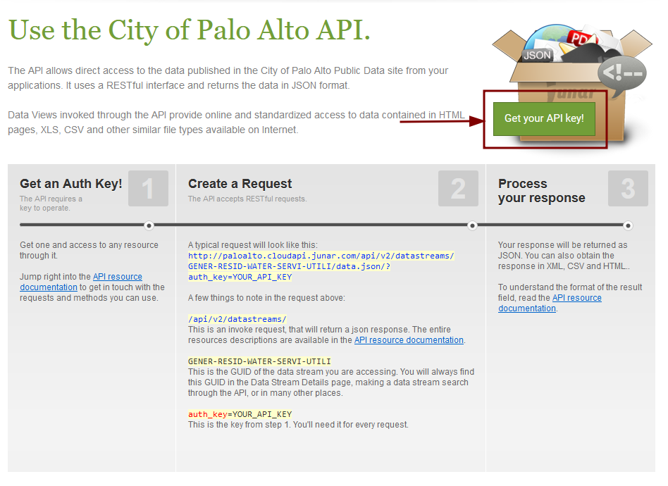

The Junar harvester is a CKAN harvester that can be used to harvest metadata from [Junar data portals](https://www.junar.com/).

Junar is a data platform that allows organizations to publish, share, and manage data in the cloud.

## Enable the Harvester

To enable the harvester, add `junar_harvester` to the `ckan.plugins` setting in your CKAN configuration file (e.g., `ckan.ini` or `production.ini`).

```ini
ckan.plugins = ... junar_harvester ...
```

## Configuration options

=== "Auth Key"
    **`auth_key`** [_optional_]

    The `Junar` API requires a key to operate. To get an auth key, you'll have to access the "Developers" page on a 
    respective Junar portal. For example, see the City of Palo Alto [data portal](https://data.cityofpaloalto.org/developers/).

    

    !!! warning
        If the `auth_key` is not provided, the `SearchError` exception will be raised.
        
    **Type**: `str`

    **Default**: `None`


    To use the Junar harvester you need to provide a Junar API key. You can get one by registering at [Junar](https://www.junar.com/).


=== "Max Datasets"
    

=== "Transmute Schema"
    
