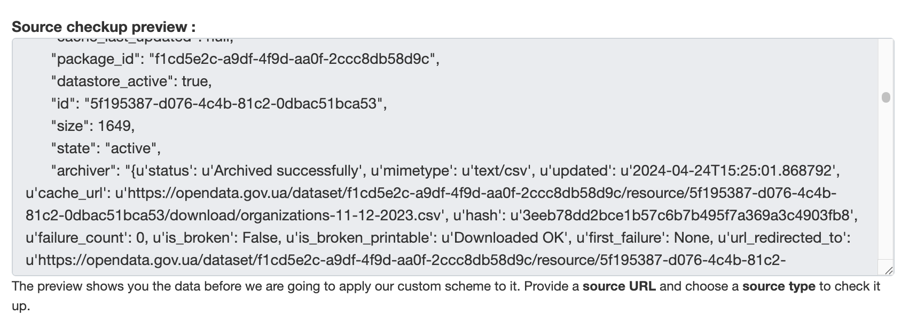

A source preview feature allows you to see the data that will be harvested from a source before you actually harvest it.

How we can use it:

* You can ensure, that the provided source URL is correct and the data is accessible.
* If remote portal requires authentication, you can check if the provided credentials are correct.
* You can see the remote portal data and adjust the transmute schema to transform the harvested data to fit your CKAN instance dataset schema.

A source preview basically uses the same logic as the harvester, but instead of creating or updating a dataset in CKAN, it just returns the harvested data. It's also harvests only 1 dataset, so it's faster than a regular harvest.

Source preview process uses the same config, as the regular harvest process, but the **transmute schema is not applied**.

## Example

On the example you can see the source preview block, which is available during the harvest source creation.

